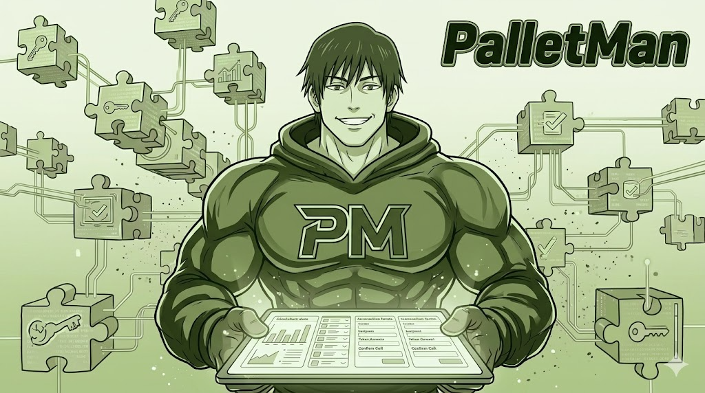
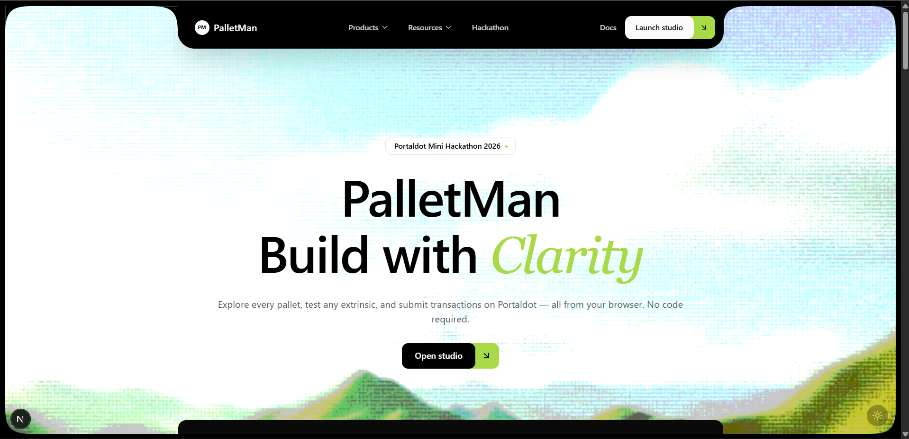
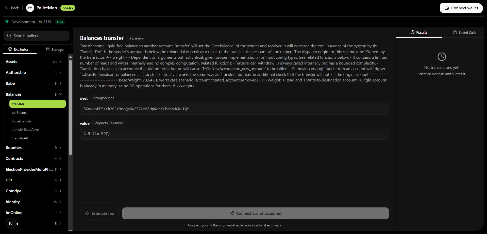
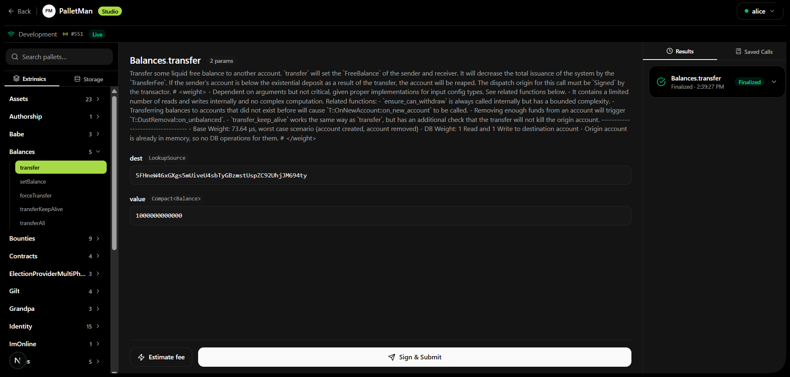

<p align="center">
  
</p>

<p align="center">
  
</p>

<h1 align="center">PalletMan</h1>

<p align="center">
  <strong>Postman for Portaldot — Browser-Based Pallet Explorer & Transaction Builder</strong>
</p>

<p align="center">
  
  
  
  
  
</p>

---

## 📋 What is PalletMan?

**PalletMan** is the first browser-based developer tool for Portaldot. It connects directly to a live node, auto-discovers every pallet, and generates a ready-to-use transaction form for every extrinsic — no code, no setup, no terminal.

> **The problem:** The only existing way to interact with Portaldot pallets is the official Python SDK — requiring code, a dev environment, and deep runtime knowledge.
>
> **The solution:** Open PalletMan in your browser. Click a pallet. Fill a form. Submit. Done.

```
Before PalletMan:   Write Python → Read Docs → Build RPC calls → Debug → Submit
With PalletMan:     Open browser → Pick pallet → Fill form → Click submit ✅
```

---

## 🖥️ Screenshots

### Landing Page
<p align="center">
  
</p>

### Extrinsic Form Builder — Auto-generated from live chain metadata
<p align="center">
  
</p>

### Transaction Finalized — Real on-chain result with events
<p align="center">
  
</p>

---

## ✨ Features

| Feature | Description |
|---|---|
| **Pallet Explorer** | Auto-discovers all pallets and extrinsics directly from live node metadata |
| **Form Builder** | Generates the correct input form for every extrinsic parameter automatically |
| **Storage Queries** | Query any live storage item from any pallet — decoded and human-readable |
| **Fee Estimator** | Shows exact POT cost before you sign anything |
| **Sign & Submit** | One-click signing via Portaldot wallet extension, broadcasts to chain |
| **Results Panel** | Displays block hash, finalization status, and all emitted events |
| **Saved Calls** | Save and reload common extrinsics — like a Postman collection for your team |

---

## 🌐 Why This Matters for Portaldot

| Problem Today | PalletMan Fix |
|---|---|
| Must write Python SDK code to interact with any pallet | Browser GUI — zero code |
| No visual way to explore what pallets and extrinsics exist | Auto-discovers everything from the live node |
| Testing txs requires a full dev environment | Works in any browser with a wallet extension |
| Fee estimation requires manual RPC calls | Built-in estimator before every submit |
| No way to share common calls across a team | Saved Calls — reusable extrinsic bookmarks |

---

## 🚀 Getting Started

### Prerequisites

- [Node.js 18+](https://nodejs.org)
- Portaldot wallet extension installed in your browser
- A running Portaldot node (local or remote)

### Step 1 — Run a Local Portaldot Node (WSL2 / Linux)

```bash
# Download and extract the node binary
cd ~
wget https://github.com/portaldotVolunteer/Portaldot-node/raw/main/portaldot-testnet-ubuntu.tar.gz
tar -xzvf portaldot-testnet-ubuntu.tar.gz
cd portaldot-testnet-ubuntu
chmod +x portaldot_dev
```

**Terminal 1 — Alice node (block producer)**
```bash
./portaldot_dev --dev --alice --name MyNode --base-path /tmp/alice
```
Copy the `Local node identity is: 12D3Koo...` Peer ID from the logs.

**Terminal 2 — Bob node (peer)**
```bash
./portaldot_dev --dev --bob --name MyNode_Bob \
  --base-path /tmp/bob \
  --port 30334 \
  --rpc-port 9945 \
  --bootnodes /ip4/127.0.0.1/tcp/30333/p2p/<ALICE_PEER_ID>
```

Success: both terminals show `💤 Idle (1 peers)` — nodes are connected.

### Step 2 — Run PalletMan

```bash
git clone https://github.com/Venkat5599/Portal-studio.git
cd Portal-studio/frontend
npm install
npm run dev
```

Open **http://localhost:3000/app** — connect your wallet and you're live.

---

## 🎬 Demo Flow

**1. Connect wallet** — Portaldot extension detected, pallets load automatically from the live chain

**2. Browse pallets** — sidebar lists every pallet with extrinsic and storage counts

**3. Build a transaction**
- Click `Balances` → `transfer`
- Fill `dest` (recipient address) and `value` (amount in planck)
- Click **Estimate Fee** → see exact POT cost

**4. Submit** — wallet signs → transaction finalizes → Results panel shows block hash + events

**5. Query storage** — Storage tab → `Balances` → `Account` → paste address → live balance appears

**6. Save calls** — Saved Calls tab → save → reload anytime → share with your team

---

## 🏗️ Architecture

```
┌──────────────────────────────────────────────────────────────┐
│                        Browser (PalletMan)                    │
│                                                               │
│  ┌─────────────────┐  ┌──────────────────┐  ┌─────────────┐  │
│  │  Pallet Sidebar │  │  Extrinsic Form  │  │   Results   │  │
│  │                 │  │     Builder      │  │  + Saved    │  │
│  │  api.tx/query   │  │  Auto-generated  │  │   Calls     │  │
│  │  parsed live    │  │  from metadata   │  │   Panel     │  │
│  └────────┬────────┘  └────────┬─────────┘  └─────────────┘  │
│           └───────────────────┬┘                              │
│                               ▼                               │
│                  ┌────────────────────────┐                   │
│                  │     @polkadot/api      │                   │
│                  │     WebSocket RPC      │                   │
│                  └────────────┬───────────┘                   │
└───────────────────────────────┼───────────────────────────────┘
                                │  ws://
                                ▼
┌──────────────────────────────────────────────────────────────┐
│                       Portaldot Node                          │
│              Alice :9944  ←→  Bob :9945                      │
└──────────────────────────────────────────────────────────────┘
```

---

## 📁 Project Structure

```
Portal-studio/
└── frontend/
    ├── app/
    │   ├── page.tsx                  # Landing page
    │   └── app/page.tsx              # Studio (main tool)
    ├── components/studio/
    │   ├── pallet-sidebar.tsx        # Pallet + extrinsic browser
    │   ├── extrinsic-panel.tsx       # Auto-generated tx form
    │   ├── storage-panel.tsx         # Live storage query
    │   ├── result-panel.tsx          # Tx results + history
    │   ├── registry-panel.tsx        # Saved calls
    │   └── wallet-button.tsx         # Wallet connect/disconnect
    ├── hooks/
    │   ├── use-polkadot-api.ts       # Node connection + metadata parsing
    │   ├── use-wallet.ts             # Wallet extension integration
    │   ├── use-extrinsic.ts          # Tx submission + fee estimation
    │   └── use-registry.ts           # Saved calls management
    ├── constants/network.ts          # RPC endpoints + chain config
    └── lib/type-mapper.ts            # Substrate type → form field mapping
```

---

## 🛠️ Tech Stack

| Layer | Technology |
|---|---|
| **Framework** | Next.js 16, React 19 |
| **Language** | TypeScript |
| **Styling** | Tailwind CSS v4 |
| **Blockchain** | @polkadot/api, @polkadot/extension-dapp |
| **Node** | Portaldot testnet (Substrate-based) |
| **Wallet** | Portaldot browser extension |

---

## 🧪 Dev Test Accounts

When running a local `--dev` node, these accounts are pre-funded with 1 billion POT:

| Account | Address |
|---|---|
| **Alice** | `5GrwvaEF5zXb26Fz9rcQpDWS57CtERHpNehXCPcNoHGKutQY` |
| **Bob** | `5FHneW46xGXgs5mUiveU4sbTyGBzmstUspZC92UhjJM694ty` |

Import Alice into your wallet:
```
Mnemonic:         bottom drive obey lake curtain smoke basket hold race lonely fit walk
Derivation path:  //Alice
```

---

## 📈 Roadmap

- [x] Live pallet browser — auto-discovers from node
- [x] Extrinsic form builder — zero config, zero ABI files
- [x] Storage query panel — live decoded values
- [x] Fee estimation before signing
- [x] Transaction submission + finalization tracking
- [x] Results panel with block hash + events
- [x] Saved Calls panel
- [x] Portaldot wallet integration
- [ ] Share saved calls via URL
- [ ] Switch RPC endpoint from the UI
- [ ] ink! contract interaction panel
- [ ] Export calls as Python SDK code snippets

---

## 🤖 AI Disclosure

Built with AI assistance (Claude). Architecture, product decisions, and Portaldot-specific integration were designed by the developer. AI was used to accelerate implementation.

---

## 📄 License

MIT

---

<div align="center">

### Built for Portaldot Mini Hackathon 2026 — Builder Tools Track

*The first browser-based developer tool for Portaldot.*

**No code. No setup. Just click and build.**

</div>
